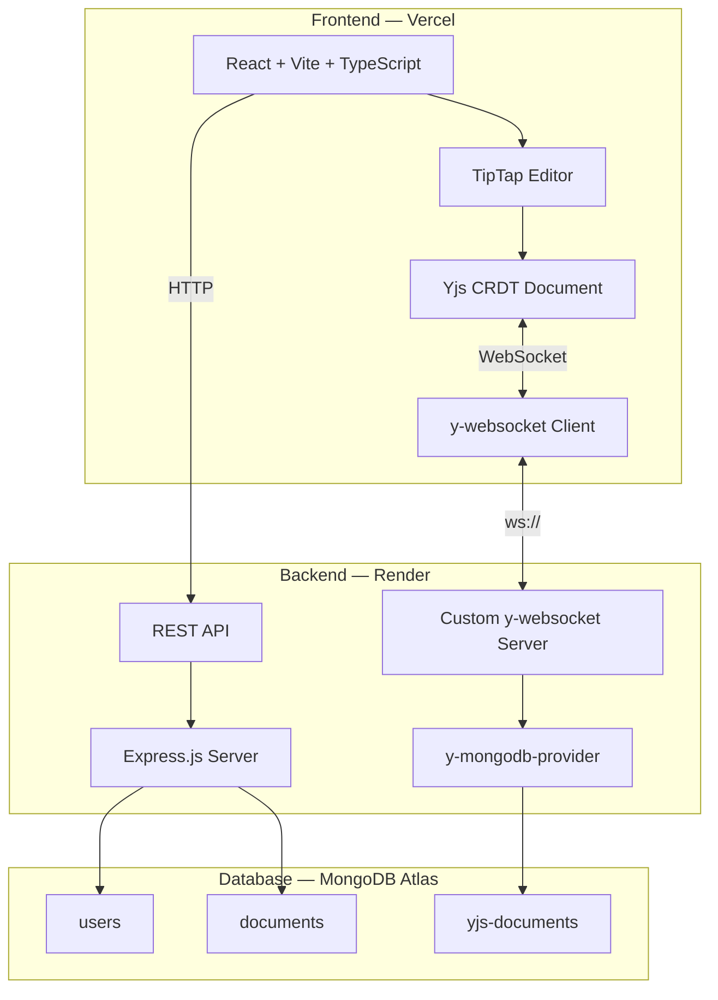

# 🚀 SyncPad — Real-Time Collaborative Text Editor

<div align="center">

**Edit documents together, in real-time.**

A production-grade collaborative editor built with CRDTs, WebSockets, and modern web technologies.

[Live Demo](https://syncpad.vercel.app) · [Video Demo](https://youtube.com) · [Report Bug](https://github.com/yourusername/syncpad/issues)

</div>

---

## ✨ Features

- **Real-time Collaboration** — Multiple users edit the same document simultaneously with instant sync
- **Conflict Resolution** — Powered by Yjs (CRDT) — no conflicts, ever
- **Live Cursors** — See other users' cursor positions with color-coded labels
- **User Presence** — Know who's online and actively editing
- **Rich Text Formatting** — Bold, italic, underline, headings, lists, blockquotes, code blocks
- **Document Persistence** — All changes automatically saved to MongoDB
- **Revision History** — Save snapshots and restore previous versions
- **Authentication** — Secure JWT-based login and registration

## 🏗️ Architecture



## 🛠️ Tech Stack

| Layer | Technology |
|---|---|
| Frontend | React 19, Vite 6, TypeScript |
| Editor | TipTap v2 (ProseMirror) |
| CRDT | Yjs |
| Real-time | WebSocket (y-websocket) |
| Backend | Node.js, Express |
| Database | MongoDB Atlas |
| Auth | JWT + bcrypt |
| Testing | Vitest, React Testing Library |
| Linting | ESLint 9 (flat config), Prettier |
| CI/CD | GitHub Actions |
| Deployment | Vercel (frontend), Render (backend) |

## 📁 Project Structure

```
SyncPad/
├── client/                 # React + Vite frontend
│   ├── src/
│   │   ├── components/     # Reusable UI components
│   │   ├── contexts/       # React contexts (Auth)
│   │   ├── hooks/          # Custom hooks
│   │   ├── pages/          # Route pages
│   │   ├── services/       # API client
│   │   └── styles/         # Design tokens & global CSS
│   └── ...
├── server/                 # Node.js backend (MVC)
│   ├── src/
│   │   ├── config/         # Database connection
│   │   ├── controllers/    # Request handlers
│   │   ├── middleware/      # Auth, error handling
│   │   ├── models/         # Mongoose schemas
│   │   ├── routes/         # Express routes
│   │   └── services/       # WebSocket, persistence
│   └── ...
└── .github/workflows/      # CI pipeline
```

## 🚀 Getting Started

### Prerequisites

- Node.js 20+
- MongoDB Atlas account (free M0 cluster)

### 1. Clone & Install

```bash
git clone https://github.com/yourusername/syncpad.git
cd syncpad

# Install server dependencies
cd server && npm install

# Install client dependencies
cd ../client && npm install
```

### 2. Configure Environment

```bash
# Server
cp server/.env.example server/.env
# Edit server/.env with your MongoDB URI and JWT secret

# Client
echo "VITE_API_URL=http://localhost:3001/api" > client/.env
echo "VITE_WS_URL=ws://localhost:3001" >> client/.env
```

### 3. Run Locally

```bash
# Terminal 1 — Start server
cd server && npm run dev

# Terminal 2 — Start client
cd client && npm run dev
```

Open `http://localhost:5173` in multiple browser tabs to test collaboration!

### 4. Run Tests

```bash
# Server tests
cd server && npm run test:run

# Client tests
cd client && npm run test:run
```

## 🎨 Design System

Built on the **"Nocturne Glass"** design system:
- Dark-mode first with deep navy backgrounds
- Vibrant purple (#6C63FF) primary accent with gradient CTAs
- Glassmorphism cards with backdrop blur
- Inter typeface with precise typographic scale
- Smooth micro-animations and transitions

## 📦 Deployment

### Frontend (Vercel)
1. Connect your GitHub repo to Vercel
2. Set root directory to `client`
3. Add env vars: `VITE_API_URL`, `VITE_WS_URL`

### Backend (Render)
1. Create a new Web Service on Render
2. Set root directory to `server`
3. Build command: `npm install`
4. Start command: `node src/index.js`
5. Add env vars: `MONGODB_URI`, `JWT_SECRET`, `CORS_ORIGIN`

### Database (MongoDB Atlas)
1. Create a free M0 cluster
2. Set network access to `0.0.0.0/0`
3. Create a database user
4. Copy the connection string to backend `.env`

## 📄 License

MIT
