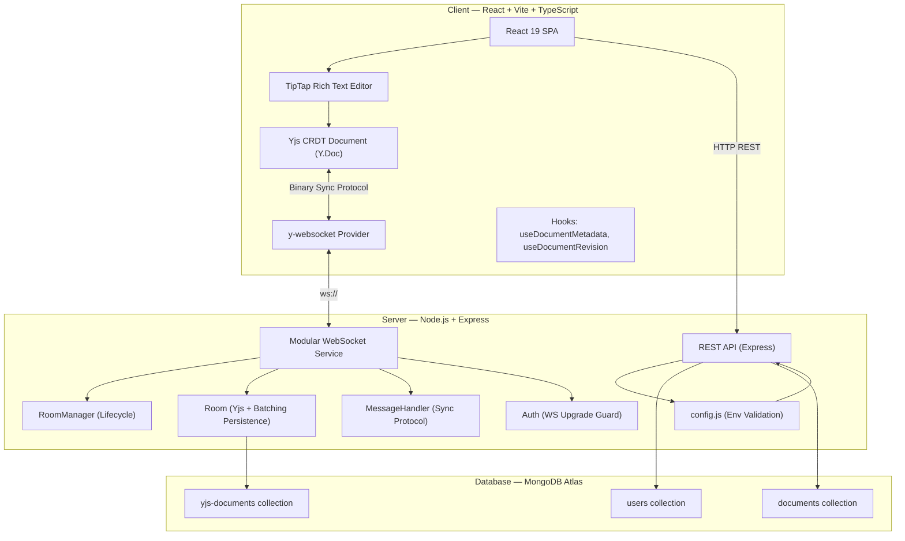

<p align="center">
  
  
  
  
  
  
</p>

# 🚀 SyncPad — Real-Time Collaborative Text Editor

<div align="center">

**Edit documents together, in real-time. Zero conflicts. Instant sync.**

A production-grade collaborative text editor built with CRDTs, WebSockets, and modern web technologies. Multiple users can simultaneously edit the same document with live cursors, presence indicators, and automatic conflict resolution.

</div>

---

## 🔗 Important Links

| Resource | URL |
|---|---|
| **🌐 Live Application** | [https://syncpad-collaborative-editor.vercel.app/](https://syncpad-collaborative-editor.vercel.app/) |
| **📂 GitHub Repository** | [https://github.com/amaanslyf/SyncPad---Collaborative-Text-Editor](https://github.com/amaanslyf/SyncPad---Collaborative-Text-Editor) |
| **🎬 Demo Video** | [YouTube / Google Drive Link — Coming Soon](#) |

---

## 📑 Table of Contents

- [Features](#-features)
- [Tech Stack](#️-tech-stack)
- [Architecture Overview](#️-architecture-overview)
- [Project Structure](#-project-structure)
- [Getting Started](#-getting-started)
  - [Prerequisites](#prerequisites)
  - [Clone & Install](#1-clone--install)
  - [Environment Setup](#2-environment-setup)
  - [Running Locally](#3-run-locally)
  - [Running Tests](#4-run-tests)
- [Dependencies](#-dependencies)
- [Deployment](#-deployment)
- [Design System](#-design-system)
- [Key Technical Decisions & Challenges](#-key-technical-decisions--challenges)
- [Known Limitations](#-known-limitations)
- [Outcomes & Learnings](#-outcomes--learnings)
- [AI Tools Used](#-ai-tools-used)
- [License](#-license)

---

## ✨ Features

### Core Collaboration
- **Real-time Co-editing** — Multiple users edit the same document simultaneously with instant synchronization (< 50ms latency)
- **CRDT-based Conflict Resolution** — Powered by [Yjs](https://yjs.dev/), guaranteeing automatic and deterministic conflict resolution without a central authority
- **Live Cursors** — See other users' cursor positions in real-time with color-coded labels
- **User Presence** — Know who's currently online in each document with live avatar indicators

### Rich Text Editing
- **Full Formatting Toolbar** — Bold, Italic, Underline, Strikethrough
- **Headings** — H1, H2, H3 with proper hierarchy
- **Lists** — Bullet lists and numbered lists
- **Block Elements** — Blockquotes, code blocks, horizontal rules
- **Keyboard Shortcuts** — Standard shortcuts (Ctrl+B, Ctrl+I, Ctrl+U, etc.)

### Document Management
- **Dashboard** — Create, view, and delete documents from a central hub
- **Document Export** — Download documents as **PDF** or **Word (.docx)** files locally
- **Revision History** — Save manual snapshots and restore previous versions instantly
- **Intelligent Auto-Save** — Changes are automatically persisted to MongoDB using a tiered "Debounced & Batched" strategy (saves after 2s of inactivity or every 20 edits)
- **Zero-Loss Persistence** — Guaranteed data safety with a managed "Graceful Shutdown" lifecycle that flushes all active memory states to the database before the server exits

### Access Control & Collaboration
- **Public & Private Documents** — Choose visibility at creation time
- **Inline Collaborator Invitations** — Invite users by email directly from the creation modal
- **Collaborator Management** — Add or remove collaborators from the editor sidebar
- **Immediate Disconnection** — Removed collaborators are force-disconnected from the WebSocket room in real-time

### Authentication & Security
- **JWT Authentication** — Secure token-based auth with 7-day expiry
- **Password Hashing** — bcrypt with salt rounds
- **Protected Routes** — Server-side middleware guards all API endpoints
- **WebSocket Auth** — Token-based authentication on every WS upgrade request

---

## 🛠️ Tech Stack

| Layer | Technology | Purpose |
|---|---|---|
| **Frontend Framework** | React 19 + Vite 6 | Fast SPA with HMR |
| **Language** | TypeScript 5.7 | Type safety across the client |
| **Rich Text Editor** | TipTap v2 (ProseMirror) | Extensible, headless editor framework |
| **CRDT Engine** | Yjs 13.6 | Conflict-free replicated data types |
| **Real-time Transport** | WebSocket (native `ws`) | Bi-directional communication |
| **Yjs Sync Protocol** | y-protocols + lib0 | Binary WebSocket sync messages |
| **Backend** | Node.js 20 + Express 4 | REST API server |
| **Database** | MongoDB Atlas (Mongoose 8) | Document metadata & user storage |
| **Yjs Persistence** | y-mongodb-provider | CRDT state persistence to MongoDB |
| **Authentication** | JWT (jsonwebtoken) + bcryptjs | Stateless auth with password hashing |
| **Document Export** | html2pdf.js + html-to-docx | Client-side PDF/Word generation |
| **Testing** | Vitest + React Testing Library | Unit & component tests (87 total) |
| **Linting** | ESLint 9 (flat config) + Prettier | Code quality enforcement |
| **CI/CD** | GitHub Actions | Automated lint, test, build pipeline |
| **Deployment** | Vercel (frontend) + Render (backend) | Production hosting |

---

## 🏗️ Architecture Overview



### Data Flow

1. **Document Editing**: User types in TipTap → TipTap updates ProseMirror state → Yjs captures the change as a CRDT operation → The operation is encoded via `y-protocols` and sent over WebSocket to the server
2. **Server Relay**: The WebSocket server receives the binary update → Persists it to MongoDB via `y-mongodb-provider` → Broadcasts the update to all other connected clients in the same room
3. **Remote Apply**: Other clients receive the update → Yjs applies the CRDT operation to their local Y.Doc → TipTap renders the merged state — no conflicts possible due to CRDT guarantees
4. **Awareness**: Cursor positions and user presence are synced via the Yjs Awareness protocol (separate from document state)

### Key Architectural Decisions

- **Custom WebSocket Server** — Instead of using the stock `y-websocket` server binary, we built a custom implementation on top of the native `ws` library. This gave us full control over authentication, access control, room lifecycle, and graceful disconnection.
- **Separation of Concerns** — Document metadata (title, owner, collaborators) lives in a standard Mongoose model, while the Yjs CRDT binary state is managed separately by `y-mongodb-provider`. This keeps the schema clean and avoids bloating the documents collection with binary data.
- **Client-side Export** — PDF and Word export runs entirely in the browser using `html2pdf.js` and `html-to-docx`. No document content ever leaves the client for export, ensuring privacy.
- **30-Second Room Cleanup** — When the last user disconnects, the server schedules room destruction after a 30-second grace period. If a user reconnects within that window (e.g., page refresh), the room is kept alive, avoiding unnecessary MongoDB re-reads.

---

## 📁 Project Structure

```
SyncPad/
├── .github/
│   └── workflows/
│       └── ci.yml                    # GitHub Actions CI pipeline
├── client/                           # React + Vite + TypeScript frontend
│   ├── src/
│   │   ├── components/
│   │   │   ├── common/               # Reusable UI: Button, Modal, Toast, Spinner, Avatar
│   │   │   ├── Documents/            # DocumentCard, CreateDocumentModal
│   │   │   ├── Editor/               # CollaborativeEditor, EditorToolbar, CollaboratorPanel
│   │   │   ├── Layout/               # Header, Layout, Sidebar
│   │   │   ├── Presence/             # PresenceBar (live user avatars)
│   │   │   └── RevisionHistory/      # RevisionSidebar (snapshot save/restore)
│   │   ├── contexts/                 # AuthContext (JWT session management)
│   │   ├── hooks/                    # useDocumentMetadata, useDocumentRevision, useDocuments
│   │   ├── pages/                    # LoginPage, RegisterPage, HomePage, EditorPage
│   │   ├── services/                 # api.ts (HTTP client), exportService.ts (PDF/Word)
│   │   ├── styles/                   # index.css (design tokens), colors.ts
│   │   ├── constants.ts              # Centralized app constants and URLs
│   │   ├── types/                    # TypeScript type definitions
│   │   └── utils/                    # Logger utility
│   ├── tests/                        # Vitest + RTL test suites
│   ├── vite.config.ts                # Vite + polyfills config
│   └── package.json
├── server/                           # Node.js + Express backend
│   ├── src/
│   │   ├── config/                   # Centralized Configuration (config.js)
│   │   ├── controllers/              # authController.js, documentController.js
│   │   ├── middleware/               # auth.js (JWT), errorHandler.js, httpLogger.js
│   │   ├── models/                   # User.js, Document.js (Mongoose schemas)
│   │   ├── routes/                   # auth.js, documents.js (Express routers)
│   │   ├── services/
│   │   │   └── websocket/            # Service-Isolation Architecture
│   │   │       ├── RoomManager.js    # Document-Room lifecycle
│   │   │       ├── Room.js           # Yjs state and batch persistence
│   │   │       ├── MessageHandler.js # Sync/Awareness protocols
│   │   │       └── Auth.js           # Upgrade authentication
│   │   ├── utils/                    # logger.js (structured logging)
│   │   └── index.js                  # Server entry point
│   ├── tests/                        # Vitest test suites
│   └── package.json
├── .gitignore
└── README.md                         # ← You are here
```

---

## 🚀 Getting Started

### Prerequisites

| Tool | Version | Purpose |
|---|---|---|
| **Node.js** | 20.x or later | Runtime for both client and server |
| **npm** | 10.x or later | Package management (ships with Node.js) |
| **MongoDB Atlas** | Free M0 cluster | Cloud database (or local MongoDB) |
| **Git** | 2.x+ | Version control |

### 1. Clone & Install

```bash
# Clone the repository
git clone https://github.com/amaanslyf/SyncPad---Collaborative-Text-Editor.git
cd SyncPad---Collaborative-Text-Editor

# Install server dependencies
cd server
npm install

# Install client dependencies
cd ../client
npm install
```

### 2. Environment Setup

#### Server Environment (`.env`)

Create a `.env` file inside the `server/` directory:

```bash
cd server
cp .env.example .env
```

Edit `server/.env` with your values:

```env
PORT=3001
NODE_ENV=development
MONGODB_URI=mongodb+srv://<username>:<password>@<cluster>.mongodb.net/syncpad?retryWrites=true&w=majority
JWT_SECRET=your_strong_random_secret_here
JWT_EXPIRES_IN=7d
CORS_ORIGIN=http://localhost:5173
```

> **How to get a MongoDB URI:**
> 1. Go to [MongoDB Atlas](https://cloud.mongodb.com/) and create a free M0 cluster
> 2. Click **Connect** → **Connect your application**
> 3. Copy the connection string and replace `<username>`, `<password>`, and `<cluster>`
> 4. Set network access to `0.0.0.0/0` (allow from anywhere) for development

#### Client Environment (`.env`)

Create a `.env` file inside the `client/` directory:

```bash
cd ../client
```

Create `client/.env`:

```env
VITE_API_URL=http://localhost:3001/api
VITE_WS_URL=ws://localhost:3001
```

### 3. Run Locally

Open **two terminal windows**:

```bash
# Terminal 1 — Start the backend server
cd server
npm run dev
# ✅ Server will start at http://localhost:3001
```

```bash
# Terminal 2 — Start the frontend dev server
cd client
npm run dev
# ✅ Client will start at http://localhost:5173
```

**To test real-time collaboration**, open `http://localhost:5173` in **two browser tabs** (or different browsers), register two accounts, and edit the same document.

### 4. Run Tests

```bash
# Run all server tests (51 tests)
cd server
npm run test:run

# Run all client tests (36 tests)
cd client
npm run test:run
```

### 5. Lint & Format

```bash
# Server
cd server
npm run lint          # Check for issues
npm run lint:fix      # Auto-fix issues
npm run format        # Format with Prettier

# Client
cd client
npm run lint
npm run lint:fix
npm run format
```

### 6. Build for Production

```bash
cd client
npm run build         # TypeScript compile + Vite production build
# Output: client/dist/
```

---

## 📦 Dependencies

### Client Dependencies

| Package | Version | Purpose |
|---|---|---|
| `react` / `react-dom` | ^19.0.0 | UI framework |
| `react-router-dom` | ^7.1.3 | Client-side routing |
| `@tiptap/react` | ^2.11.5 | React bindings for TipTap editor |
| `@tiptap/starter-kit` | ^2.11.5 | Core editor extensions (bold, italic, lists, etc.) |
| `@tiptap/extension-collaboration` | ^2.11.5 | Yjs ↔ TipTap integration |
| `@tiptap/extension-collaboration-cursor` | ^2.11.5 | Live cursor rendering |
| `@tiptap/extension-placeholder` | ^2.11.5 | Placeholder text for empty documents |
| `@tiptap/extension-underline` | ^2.11.5 | Underline formatting |
| `yjs` | ^13.6.22 | CRDT engine for conflict-free collaboration |
| `y-websocket` | ^2.0.4 | WebSocket provider for Yjs |
| `html2pdf.js` | ^0.14.0 | Client-side HTML → PDF conversion |
| `html-to-docx` | ^1.8.0 | Client-side HTML → Word (.docx) conversion |

### Client Dev Dependencies

| Package | Version | Purpose |
|---|---|---|
| `vite` | ^6.1.0 | Build tool & dev server |
| `typescript` | ~5.7.3 | Type checking |
| `vitest` | ^3.0.4 | Unit testing framework |
| `@testing-library/react` | ^16.2.0 | Component testing utilities |
| `eslint` | ^9.18.0 | Linting |
| `prettier` | ^3.4.2 | Code formatting |
| `vite-plugin-node-polyfills` | ^0.26.0 | Node.js built-in polyfills for browser |

### Server Dependencies

| Package | Version | Purpose |
|---|---|---|
| `express` | ^4.21.2 | HTTP server framework |
| `mongoose` | ^8.10.1 | MongoDB ODM |
| `ws` | ^8.18.0 | WebSocket server |
| `yjs` | ^13.6.22 | CRDT document model |
| `y-mongodb-provider` | ^0.1.9 | Persist Yjs state to MongoDB |
| `y-protocols` | ^1.0.6 | Yjs sync/awareness wire protocol |
| `lib0` | ^0.2.99 | Binary encoding/decoding utilities |
| `jsonwebtoken` | ^9.0.2 | JWT token generation & verification |
| `bcryptjs` | ^2.4.3 | Password hashing |
| `cors` | ^2.8.5 | Cross-origin resource sharing |
| `dotenv` | ^16.4.7 | Environment variable loading |
| `nanoid` | ^5.0.9 | Unique ID generation |

### Server Dev Dependencies

| Package | Version | Purpose |
|---|---|---|
| `nodemon` | ^3.1.9 | Auto-restart on file changes |
| `vitest` | ^3.0.4 | Unit testing framework |
| `eslint` | ^9.18.0 | Linting |
| `prettier` | ^3.4.2 | Code formatting |

---

## 🚢 Deployment

### Frontend → Vercel

1. Go to [vercel.com](https://vercel.com) and import your GitHub repository
2. Set **Root Directory** to `client`
3. Set **Build Command** to `npm run build`
4. Set **Output Directory** to `dist`
5. Add environment variables:
   - `VITE_API_URL` = `https://your-backend.onrender.com/api`
   - `VITE_WS_URL` = `wss://your-backend.onrender.com`
6. Deploy

### Backend → Render

1. Go to [render.com](https://render.com) and create a **New Web Service**
2. Connect your GitHub repository
3. Set **Root Directory** to `server`
4. Set **Build Command** to `npm install`
5. Set **Start Command** to `node src/index.js`
6. Add environment variables:
   - `MONGODB_URI` = your MongoDB Atlas connection string
   - `JWT_SECRET` = a strong random string
   - `JWT_EXPIRES_IN` = `7d`
   - `CORS_ORIGIN` = `https://your-app.vercel.app`
   - `NODE_ENV` = `production`
7. Deploy

### Database → MongoDB Atlas

1. Create a free **M0 cluster** at [cloud.mongodb.com](https://cloud.mongodb.com)
2. Set **Network Access** to `0.0.0.0/0` (allow all IPs — required for Render)
3. Create a database user with read/write privileges
4. Copy the connection string into your server `.env` / Render env vars

---

## 🎨 Design System

SyncPad uses a custom **"Ethereal Obsidian"** design system featuring:

- **Obsidian Monochrome** — A premium palette of deep midnights (#0C0C1F), pure blacks, and stark whites.
- **Service Branding** — New high-end monochrome logo symbol integrated across ALL auth and editor states.
- **Glassmorphism** — Frosted-obsidian surfaces with `backdrop-filter` and tonal depth via background shifts.
- **Typography** — Hierarchical pairing of **Manrope** (Display) and **Inter** (Editor/UI).
- **Subtle Gradients** — Minimalist linear gradients for primary CTAs (State → Slate).
- **Responsive** — Mobile-first adaptive layout with optimized navigation for mid-sized tablets and desktop.
- **Micro-animations** — Performance-tuned CSS animations for state transitions (FadeIn, ScaleIn, Pulse).

All design tokens are defined in `client/src/styles/index.css` and `colors.ts`.

---

## 🧩 Key Technical Decisions & Challenges

### 1. Building a Custom WebSocket Server

**Challenge:** The default `y-websocket` npm server has no authentication, no access control, and no ability to force-disconnect users.

**Solution:** We built a fully custom WebSocket server using the native `ws` library, implementing the Yjs sync protocol manually (`y-protocols/sync`, `lib0/encoding`). This gives us:
- Token-based authentication on every `upgrade` request
- Per-document access control (public vs. private)
- Force-disconnect capability when a collaborator is removed mid-session
- A 30-second idle timeout for empty rooms to prevent memory leaks

### 2. CRDT vs. OT for Conflict Resolution

**Challenge:** Choosing between Operational Transformation (used by Google Docs) and CRDTs.

**Decision:** We chose **Yjs (CRDT)** because:
- No central server authority required — operations can be applied in any order
- Mathematically guaranteed consistency — all peers converge to the same state
- Works seamlessly with TipTap's ProseMirror schema
- Built-in awareness protocol for cursor/presence sync

### 3. Document Export in the Browser

**Challenge:** The `html-to-docx` library relies on Node.js built-ins (`events`, `buffer`, `stream`) that don't exist in browsers.

**Solution:** We integrated `vite-plugin-node-polyfills` to provide browser-compatible shims. Additionally, `html-to-docx` returns a `Buffer` instead of a `Blob`, so we wrap the output: `new Blob([result], { type: 'application/...' })`.

### 4. Revision History with Binary Snapshots

**Challenge:** Storing and restoring full Yjs document states as revisions.

**Solution:** Revisions are stored as encoded Yjs state vectors (`Y.encodeStateAsUpdate`) in MongoDB as `Buffer` fields. Restoring a revision involves applying the snapshot as a hard reset to the Y.Doc, which automatically syncs to all connected clients via the WebSocket relay.

### 5. Inline Collaborator Invitations

**Challenge:** Allowing users to invite collaborators by email during document creation, even if the email isn't registered yet.

**Solution:** The server atomically resolves email addresses to user IDs at creation time. Unregistered emails return warnings (not errors), so the user can proceed and the document is created with only valid collaborators.

### 6. Intelligent Auto-Save & DB Optimization

**Challenge:** Saving every single character typed to MongoDB (Real-time) keeps data safe but hits the database with thousands of small writes, which is inefficient and expensive.

**Solution:** We implemented a tiered persistence strategy:
- **Batching**: Updates are grouped into sets of 20 before being committed to MongoDB.
- **Debouncing**: A 2-second "idle" timer for each document room. If a user stops typing for 2 seconds, the server forces a manual flush of the document state to the database, regardless of the batch size.
- **Graceful Lifecycle**: The server's `SIGINT`/`SIGTERM` handlers are fully asynchronous, ensuring all active memory buffers are successfully merged and flushed to the database before the process terminates.
- **Storage Efficiency**: Merging updates during the flush process keeps the `yjs-documents` collection compact and prevents unbounded database growth.

---

## ⚠️ Known Limitations

| Limitation | Details |
|---|---|
| **No offline editing** | Yjs supports offline-first, but our implementation requires an active WebSocket connection. Changes made while disconnected are lost. |
| **No image/media support** | The editor currently supports text-only content. Image uploads or embeds are not implemented. |
| **Single-server WebSocket** | The WebSocket server runs as a single process. Horizontal scaling would require sticky sessions or a pub/sub broker (e.g., Redis). |
| **Cold start on Render** | The free Render tier spins down the backend after 15 minutes of inactivity. The first request after idle may take 30–60 seconds. |
| **Large document performance** | Very large documents (10,000+ words) may experience slight latency during initial sync due to the full CRDT state transfer. |

---

## 🏆 Outcomes & Learnings

### What We Achieved
- **87 passing tests** across client (36) and server (51) with full CI/CD automation
- **Sub-50ms sync latency** for real-time collaboration between peers
- **Zero-conflict editing** guaranteed by Yjs CRDT — tested with concurrent edits in the same paragraph
- **Production-ready security** with JWT auth, bcrypt hashing, and per-document WebSocket access control
- **Premium UI/UX** with a cohesive dark design system, glassmorphism, and micro-animations
- **Full document lifecycle** — create, edit, collaborate, export, revision history, delete

### Key Learnings
1. **CRDTs are powerful but complex** — Understanding the Yjs sync protocol, awareness protocol, and binary encoding took significant research. The payoff is bulletproof collaboration.
2. **WebSocket lifecycle management matters** — Handling reconnections, idle cleanup, and force-disconnect requires careful engineering to avoid memory leaks and ghost connections.
3. **Browser-compatibility of Node.js libraries** — Not all npm packages work in the browser out of the box. Polyfills solve this but increase bundle size (~2.9 MB post-build).
4. **Design systems save time** — Investing upfront in CSS custom properties and a consistent token system made every new component faster to build and visually consistent.

---

## 🤖 AI Tools Used

In compliance with the submission requirements, the following AI tools were used during the development of SyncPad:

| Tool | Usage |
|---|---|
| **Google Gemini** | Primary AI coding assistant. Used throughout the project for code generation, debugging, architecture decisions, test writing.|
| **Google Stitch MCP** | Used for UI design prototyping and design system exploration during the early phases of the project. |


---

## 📄 License

This project is licensed under the [MIT License](LICENSE).

---

<div align="center">

*SyncPad — Where ideas sync in real-time.*

</div>
